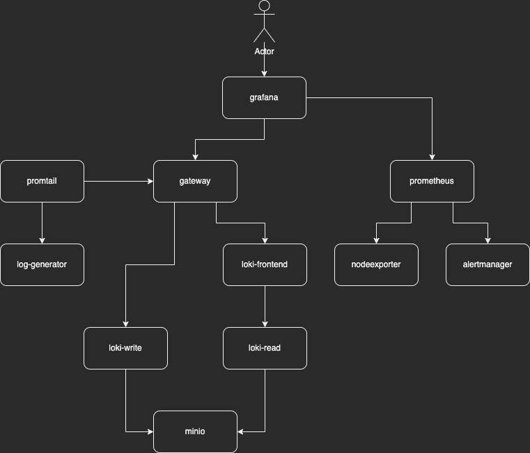

# grafana-suite-docker-compose

## Requirements

* [https://www.docker.com/](https://www.docker.com/)

## Diagram



## Install

### Init

Start All

```sh
docker compose up -d
```

Stop

```sh
docker compose stop
```

> If Operative System is Linux:
>
> ```sh
> sudo chmod 777 -R data
> ```

### URLs

* [Grafana](http://localhost:3000)
* [Prometheus](http://localhost:9090)
* [Alertmanager](http://localhost:9093)

## Documentation

* [https://docs.docker.com/](https://docs.docker.com/)
* [https://grafana.com/docs/](https://grafana.com/docs/)
